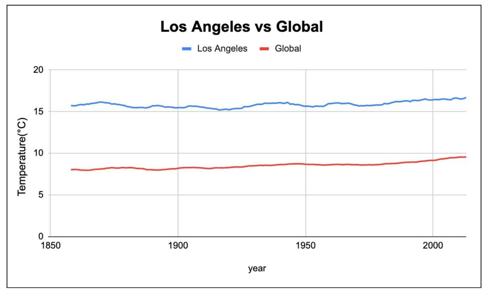

# Explore-Weather-Trends
Analyze local and global temperature data

In this project, you will analyze local and global temperature data and compare the temperature trends where you live to overall global temperature trends.

## Goals
* View the city and country list from the ‘city_list’ database
* Extract the city level data from the from the closest big city that you live in from the ‘city_list’ database
* Extract the global temperature data from the ‘global_data’ database

## SQL Queries
1.  To view the closest big city near I live
	```
	SELECT * FROM city_list 
  	WHERE country = ‘United States’
	```
2. To extract the city level data
	```
	SELECT * FROM city_list
	WHERE country = ‘United States’
	AND city = ‘Los Angeles’
	```
3. To join the city level data and global data based on the common field and download the file as ‘results.csv’
	```
	SELECT city_data.avg_temp as city_avg_temp, global_data.avg_temp as global_avg_temp, global_data.year
  	FROM global_data
  	JOIN city_data
  	ON global_data.year = city_data.year
  	WHERE country = 'United States'
  	AND city = 'Los Angeles'
	```
                             Moving Average Temperature of Los Angeles vs Global over the 10 years


